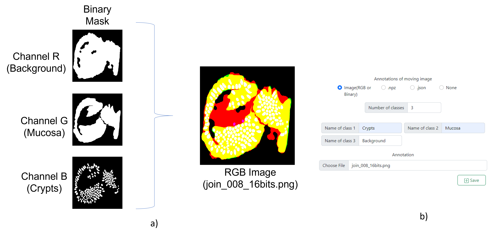

# MMIR
## Multimodal Image Registration focused on histological images

MMIR is a Cloud base system  that allows the user:


- Execution of a pipeline for image registration using different algorithms.

- Visualize the annotations as semantic segmentation.

- Visualize the images with a pyramid organization.

- Add new image registration algorithms as plugins.

- Manage Projects.


### Brief overview
MMIR is a web-based system that allows the end-user to register biological images and compare the outcomes of different algorithms through visualization tools. 
Our system contains three main modules: (1) a system manager, (2) an algorithm manager, and (3) an image visualization system (Fig. 1). 
The system manager creates, reads, updates, and deletes projects, as well as establish a direct connection with the database where the initial images and results will be stored. 
The algorithm manager oversees carrying out the execution pipeline of each algorithm using a plugin architecture. Finally, the visualization system allows to the user interact with the results through different visualization tools. 
The system was developed using the framework Django, JavaScript, and multiple libraries that facilitate the management and annotation of very high-resolution images.


>Figure 1: Proposed registration system with three main modules. A system manager, An algorithm manager, and an image visualization system.

### Initialize without docker
Dependencies:
- MySQL
- Python 3

Create a DB in MYSQL

Install all the requirement libraries:
```
pip install -r requirements.txt
```
add the environment variables (modify according to your DB configuration)
    With linux:
        execute the scripts mmmir_gui/localVar.sh 
    With Windows added manually

Generate the migrations
```
python manage.py makemigrations
```
Migrate to mysql
```
python manage.py migrate
```
Run the server
```
python manage.py runserver
```
### Initialize with docker
Dependencies:
- Docker
- Docker-compose


Build the image
```
docker-compose build
```
Run the MySQL container
```
docker-compose up db
```
Run the server
```
docker-compose up -d
```


### Batch vs Single Registration
With MMIR-Gui you can perform the registration of a pair of images or a batch of pairs.
The batch system allows you to load n number of files and n number of annotations. By choosing this option you should load the same number of files in the fixing images, moving images, and annotations, except if a JSON file is used.

### Fix - Moving Images
Internally all images are read using the python OpenCV library, so only the formats of this library are supported, in the future we intend to add more extensions related to biological formats.


### Annotations
There are 3 ways to load annotations, through images, using .npz files or through JSON files using the COCO format.
#### Images
The images could be RGB (3 channels) or Binary (one channel) images. 
Every channel of the image must be a binary mask with all the annotations of one class. 
One example of an RGB image with three annotation classes is shown in Figure 2a. 
When a new project is created with an image annotation is necessary to define the name of every class.
Due to MMIR-Gui using OpenCV to load the images, the names will be defined in BGR order, Figure 2b shows an example of the interface with the data information of image 2a.


>Figure 1: Image Annotation. a) RGB image annotation example. b) Image annotation form in MMIR-Gui interface.
#### .npz
If there are more than three classes, you can use an .npz file instead of an image.
```
import cv2
import numpy as np
//read N binary images
Image_class_1 = cv2.imread("path/to/the/binary/image1")
Image_class_2 = cv2.imread("path/to/the/binary/image2")
*
*
*
Image_class_N = cv2.imread("path/to/the/binary/imageN")

//Add N classes to an array
numpyArray[:,:,0] =  Image_class_1
numpyArray[:,:,1] =  Image_class_2
*
*
*
numpyArray[:,:,N] =  Image_class_N

//save the .npz file
np.savez("output/path/to/the/file.npz", numpyArray )
 
```
#### JSON with COCO format
Annotations can also be uploaded as a JSON file using the COCO format. 
```
"images":[ {"id": 0,
	     "height": 832,
            "width": 832,
	     "file_name": "TCGA-A1-A0SP-DX1_.png"
        	}, …], 
"annotations":[ { "id": 0, "area": 1995.0, 
	     "iscrowd": 0,
            "segmentation":[ [527.0, …, 275.5] ],
            "bbox": [ 483, 232, 60,45],
            "image_id": 0,
            "category_id": 1
        }, …],
"categories": [ { "id": 1, "name": "tumor"}, …,
        { "id": 13, "name": "unlabeled"} ]

```

Some information to remark:
- A single JSON file will always be requested regardless of whether it is a batch project or not.
- The File_name must match the name of the moving_image to be loaded.

### Plug-in

The Plug-in architecture allows the addition of new algorithms without modifying the existing code. The following steps are necessary to add a new algorithm.
1.	In the JSON main/plugins/plugins_list.json add the name of the plugin that will be loaded.
```
{
  "plugins": [
    "sift_algorithm", "orb_alg", "Sift_color_Invertion", "Orb_color_Invertion",”newPlugin”
  ]

}


```
2. In the main/plugins/ folder add a .py file with the same name added in plugins_list.json.
3. In that file create the new Plug-in, the code base can be seen below.
```
from main.algorithmsPlugin import algorithm
from main.algorithmsPlugin.plugin_register import *
	
class newPlugin(algorithmCore):
	
	def run(self):
		fixing_Image = self.fix_image
		moving_Image = self.mov_image
		
		#Do something
		results = {
		    #mandatory
		    "succ" : Boolean to show if the algorithm finalize correctly,
		    "warping": new registration image in BGR Mode as in OpenCV,
		    #mandatory with annotations
		    "homography": homography_matrix like OpenCV.findHomography(),
		    #optional
		    #If any of these optional keys are unused, they may return a None value in the dictionary.
		    "f_mov": Image in BGR with the features find it in the moving image,
		    "f_fix": Image in BGR with the features find it in the fixing image,
		    "lineMatch": Image in BGR with the line matches,
		    "messages": string characters with the error information (in case the execution was not correct)
		    }
		    
		return results

def initialize() -> None:
    register("NewPLuginName", newPlugin)

```

Different examples of plugins could be found in main/plugins/ folder
